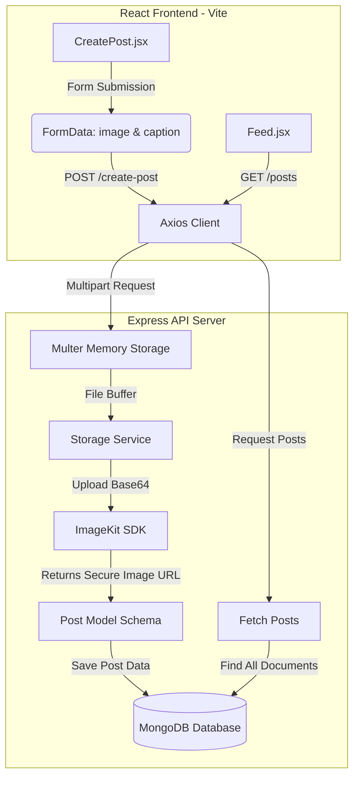

# 🌌 Cloud-Service Post Sharing Feed

A full-stack, cloud-powered post sharing application. This project features a modern **React (Vite)** frontend that connects to an **Express/Node.js** backend, utilizing **ImageKit.io** for seamless cloud image hosting and **MongoDB** for persistent post storage.

---

## 🚀 System Architecture

Below is the workflow of how an image and caption are processed and served within the system:



---

## ✨ Features

- 🖼️ **Cloud Image Storage:** Securely uploads images to the cloud using [ImageKit.io](https://imagekit.io/).
- 📝 **Post Captions:** Users can add descriptive text captions to their uploaded images.
- 📱 **Dynamic Feed:** Instantly updates to display newly posted images and captions.
- ⚡ **Optimized UI UX:** 
  - Prevents accidental multiple submissions by disabling the upload button during progress.
  - Responsive cards with clean layouts.
- 🔒 **Environment Variables:** Keeps secrets and database connection strings secure in `.env`.

---

## 🛠️ Tech Stack

| Component | Technology | Description |
| :--- | :--- | :--- |
| **Frontend** | React (v19) | Modern component-based web UI library |
| | Vite | Hyper-fast dev server and bundler |
| | React Router Dom | Single Page Application (SPA) client-side routing |
| | Axios | Promise-based HTTP client for API requests |
| **Backend** | Node.js / Express | Fast, unopinionated minimalist web framework |
| | Multer | Middleware for handling `multipart/form-data` uploads |
| | ImageKit Node SDK | Official SDK for uploading files to ImageKit storage |
| | MongoDB / Mongoose | Object Data Modeling (ODM) library for MongoDB |

---

## 📂 Project Structure

```text
cloud-service-project/
├── backend/
│   ├── src/
│   │   ├── db/
│   │   │   └── db.js            # MongoDB Connection configuration
│   │   ├── models/
│   │   │   └── post.model.js    # Mongoose Schema for Posts
│   │   ├── services/
│   │   │   └── storage.service.js # ImageKit Cloud File Upload Service
│   │   └── app.js               # Express application and route handlers
│   ├── .env                     # Local environment configurations (private)
│   ├── server.js                # App entrypoint (starts the server)
│   └── package.json
├── frontend/
│   ├── src/
│   │   ├── assets/              # Static assets
│   │   ├── pages/
│   │   │   ├── CreatePost.jsx   # Image upload and caption creation page
│   │   │   └── Feed.jsx         # Feeds timeline display page
│   │   ├── App.jsx              # Routing configurations
│   │   ├── main.jsx             # React entrypoint
│   │   ├── App.css              # Custom styling for components
│   │   └── index.css            # Base/global CSS configuration
│   └── package.json
└── README.md                    # Project Documentation (You are here)
```

---

## 🔑 Setup & Installation

### Prerequisites
- [Node.js](https://nodejs.org/) installed on your machine.
- A [MongoDB Atlas](https://www.mongodb.com/cloud/atlas) account (or a local MongoDB instance).
- An [ImageKit.io](https://imagekit.io/) account for image storage.

---

### Step 1: Clone and Install Dependencies

1. Clone this repository to your local machine.
2. Install **Backend** dependencies:
   ```bash
   cd backend
   npm install
   ```
3. Install **Frontend** dependencies:
   ```bash
   cd ../frontend
   npm install
   ```

---

### Step 2: Configure Environment Variables

Create a file named `.env` in the `backend/` directory with the following variables:

```env
# Port is optional, server.js defaults to port 3000
PORT=3000

# MongoDB URI connection string
MONGO_URI=your_mongodb_connection_string

# ImageKit Private Key (Retrieved from ImageKit developer dashboard)
IMAGEKIT_PRIVATE_KEY=your_imagekit_private_key
```
---

### Step 3: Run the Application

#### Start the Backend Server:
From the `backend` directory, start the server:
```bash
node server.js
```
The server will start at `http://localhost:3000` and output:
```text
Connected to DB
Server is running on port 3000
```

#### Start the Frontend Development Server:
From the `frontend` directory, start the Vite development server:
```bash
npm run dev
```
Open the provided local address (usually `http://localhost:5173`) in your browser.

---

## 📡 API Documentation

### 1. Create a Post
- **Endpoint:** `/create-post`
- **Method:** `POST`
- **Content-Type:** `multipart/form-data`
- **Request Parameters:**
  - `image` (File, Required): The image to be uploaded.
  - `caption` (String, Required): Description for the post.
- **Response (201 Created):**
  ```json
  {
    "message": "Post created successfully",
    "post": {
      "_id": "648fbc8a...",
      "image": "https://ik.imagekit.io/.../image.jpg",
      "caption": "Your Caption text here"
    }
  }
  ```

### 2. Fetch All Posts
- **Endpoint:** `/posts`
- **Method:** `GET`
- **Response (200 OK):**
  ```json
  {
    "message": "Posts fetched successfully",
    "posts": [
      {
        "_id": "648fbc8a...",
        "image": "https://ik.imagekit.io/.../image.jpg",
        "caption": "Your Caption text here"
      }
    ]
  }
  ```

---

## 🛤️ Page Routes

- **`/feed`**: View the list of all shared posts.
- **`/create-post`**: Form to select an image, write a caption, and publish it to the feed.

---

## 📄 License

This project is licensed under the terms of the MIT License. See the [LICENSE](LICENSE) file for details.